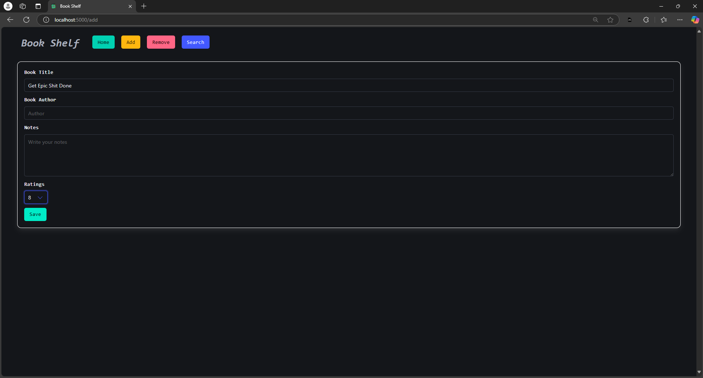

# 📚 Book Shelf

Book Shelf is a full-stack web application where users can add, manage, and store notes about the books they've read. It allows users to save descriptions, ratings, and personalized notes. The application uses PostgreSQL as the database and integrates with the Open Library API to fetch book details. Google Generative AI is utilized to generate notes for books, enhancing the reading experience.

## 🌟 Features

- Add and manage books with descriptions, ratings, and notes.
- Fetch book details like author and cover image using the Open Library API.
- Generate book notes automatically using Google Generative AI.
- Clean, user-friendly interface styled with Bulma.io CSS framework.
- PostgreSQL for efficient data storage.

## 🛠️ Tech Stack

- **Frontend:** HTML, CSS Framework(Bulma.io), JavaScript (ES Modules)
- **Backend:** Node.js, Express.js
- **Database:** PostgreSQL
- **APIs:** Open Library API, Google Generative AI

## 🚀 Getting Started

Follow these steps to install and run the project locally.

### 1. Clone the Repository

```bash
git clone https://github.com/manthangirish/book-shelf.git
cd book-shelf
```

### 2. Install Dependencies

```bash
npm install
```

### 3. Set Up Environment Variables

Create a `.env` file in the root directory and add the following variables: (Get the API Key from [Google Cloud](https://ai.google.dev/gemini-api/docs/api-key))
 

```bash
GOOGLE_API_KEY=your-api-key
```

### 4. Run PostgreSQL Database  
- Change the parameter of user, password, port, host and database in index.js file.


### 5. Start the Application and the Custom Gen-AI API

```bash
node apiDescription.js
node index.js
```

The application will be available at `http://localhost:3000`.


## 📝 Note

- Ensure the PostgreSQL database is running before starting the application.
- The `node_modules` and `.env` files are excluded from version control for security and efficiency.

## 📖 Demo

### 🏠 Home Page


### 🗒️ Notes Page


### 📖 Add Book Page


### 🗑️ Delete Book Page


### 📝 Edit Notes Page


---

Enjoy tracking your reading journey with **Book Shelf**! 📖✨

